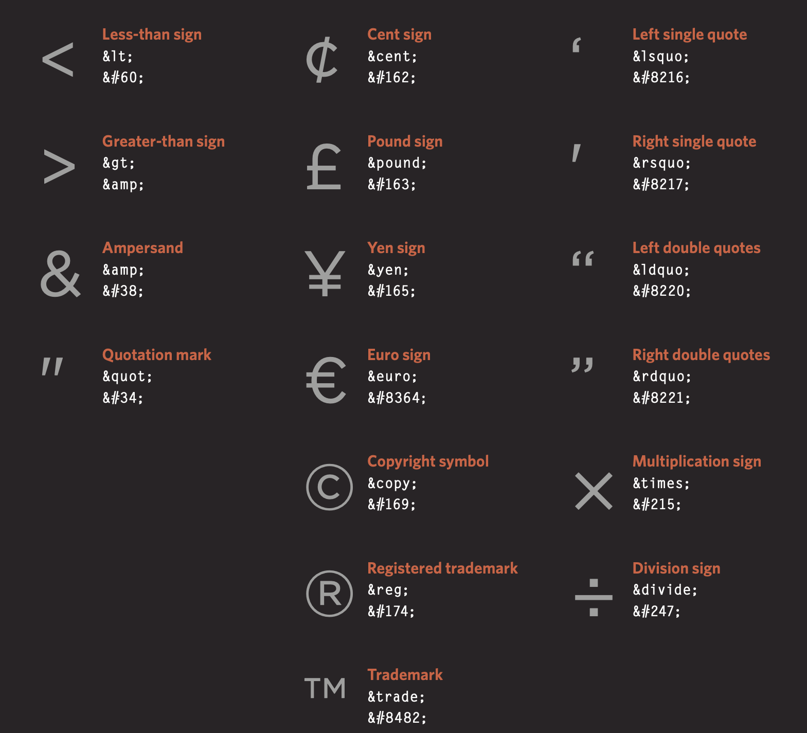

# Duckett: HTML & CSS, Chapter 8 - Extra Markup

- 'HTML4' released in 1997
- 'XHTML 1.0' released in 2000 with two versions _Strict_ and _Transitional_
- 'HTML5' releases in 2000 and still being written to date.

## Comments

Comments assist reading and understanding ones intent of code lines. They serve as notes for reason and should be used for future reference.

If you want to add comments not visible on the user's browser use the below code.

- &lt;!--comment message--&gt;

## 'Class' Attribute

- 'class' Can be used many times over.
  > The class attribute on any element can share the same value.

## 'ID' Attribute

- 'ID' - has to be used uniquely.
  > It is important that no two elements on the same page
  > have the same value for their id attributes

## &lt;div&gt; Element

A 'Div' is an element that allows to group a set of other elements in one box-level box.
Example you can have 'H1' , 'Nav' and 'li' nested in one 'Div' that can be styled by **Css**

## &lt;Span&gt; Element

A 'Span' element can be used inline another element like for example 'P' element.

> The most common reason why people use < span > elements is so that they can control the appearance of the content of these elements using CSS.

## &lt;iframe&gt; Element

This is a little window on the webpage, like a google map to your location on the side.
This element needs 'src' , 'height' and 'width' attributes to go along with it.

## &lt;meta&gt; Element

> The < meta > tag allows you to supply all kinds of information about your web page.

## Escape Characters

> Escape characters are used to include special characters in your pages such as <, >, and ©
> 

# Duckett: HTML & CSS, Chapter 17 - HTML5 Layout

- &lt;header&gt; - site name / logo and main navigation
- &lt;footer&gt; - Same as header just at bottom of page that may contain links to privacy / copyright content.
- &lt;nav&gt; - menu style list
- &lt;article&gt; - information text , which can also be nested inside it's self
- &lt;aside&gt; - relevant but not essential
- &lt;section&gt; - groups related content for pages with lots of content.
- &lt;hgroup&gt; - groups element for a heading with sub-heading. 'H1'-'H6'.

* &lt;figure&gt; and &lt;figcaption&gt;
  - used to include:
    - Images
    - Videos
    - Graphs
    - Diagrams
    - Code samples
    - Text that supports the main body of an article

Older browsers that do not know the new **HTML5 elements** will automatically treat them as incline elements. To have the browser treat them as block-level elements you should include the below in your **css style sheet**

> header, section, footer, aside, nav, article, figure
> {
> display: block;}

# Duckett: HTML & CSS, Chapter 18 - Process & Design

Things to consider when you design a web site:

1. Target Audience : Individuals
1. Target Audience : Companies
1. User goals and motivation
1. Interactivity level
1. How often will users return visit the web site
1. How often will does the content need updating.

When designing a website take time to compile

- Content
- Prioritizing
- Organizing
- Visual hierarchy
- Grouping
- Similarity

Designing navigation must be concise , clear , selective, context, interactive and consistent.

Utilize site maps and wireframes to your advantage when designing website.

Keep in mind that you can differentiate between pieces of information using size, color, and style.
